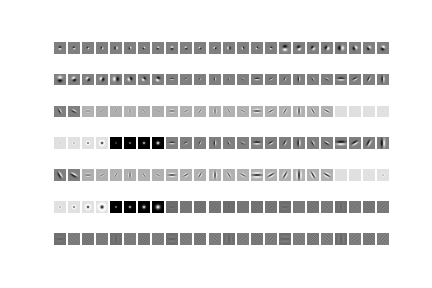
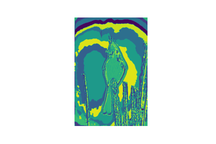
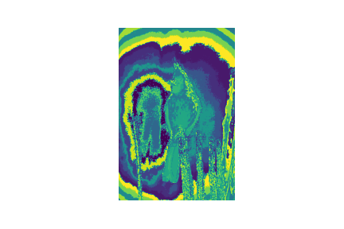
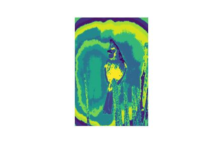

# Pb-lite_Edge_Detection

In this assignment, a Pb (Probability of Boundary) algorithm is implemented which improves the classical methods of edge detection like Canny and Sobel baselines. This algorithm considers 4 steps:
- Generating filter bank: Oriented DoG filters, Leung-Malik Filters and Gabor Filters
- Computing Texton, Brightness and Color map
- Finding the gradients of texture, brightness and color for each pixel
- Combining the output with Canny and Sobel for boundary detection

## Generating Filter Bank
1. Oriented DoG Derivative of Gaussian filters: A simple DoG filter is created by convolving a Gaussian kernel with Sobel filter.
2. Leung-Malik Filters: The Leung-Malik filters or LM filters are a set of multi scale, multi orientation filter bank with 48 filters. It consists of first and second order derivatives of Gaussians, Laplacian of Gaussian (LOG) filters and Gaussians. This filter has been applied in two versions: LM Small and LM Large.
3. Gabor Filters: The gabor filter has a gaussian kernel modulated with a sinusoidal plane kernel.

## Computing Texton, Brightness and Color map
To create Texton maps, all the filters (total 168) are applied to the image and a stack of resultant outputs is obtained. Further, the pixels having similar texture properties are grouped using KMeans clustering method and then a discrete texton ID is assigned to each pixel. Similarly, the brightness and color maps are used to encode the intensity and color values for each pixel respectively.

    
    
    

## Gradients of Texture, Brightness and Color for each pixel
Gradient maps help us to define a series of local gradient measurements i.e. the change in distributions of texture, brightness and color at a particular pixel.

## Combining the output with Canny and Sobel for boundary detection
